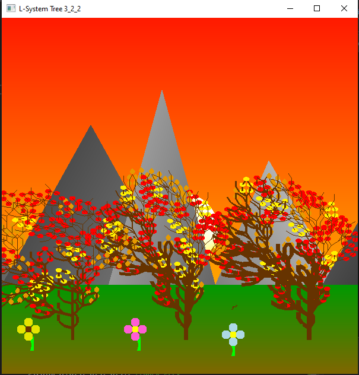

# Computer Graphics Class

Homework 1 Problem 1 Creative - 2D House with menu

Homework 2 Problem 1 - Dinosaur circular rotations

Project 1 Problem 1 - 3D House and Car

Project 2 Problem 2 - Teapot Matrix

Homework 3 Problem 2_2 - Creative L-system Tree

Project 2 - 3D scene
